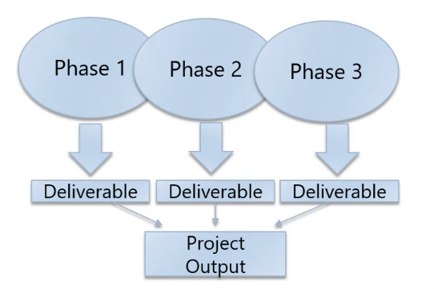

# Phases and deliverables

A **phase** is a collection of logically related project activities that
culminates in the completion of one or more **deliverables**. The number of
**phases** to complete a **deliverable** depends on the type of industry and
size and complexity of the project.

A **deliverable** is any unique and verifiable product, service, or result. Some
properties of **deliverables** are:

* May be tangible or intangible
* Must be accepted by the customer or sponsor for the phase

A high-level diagram of **phases** and **deliverables** can be found below:

