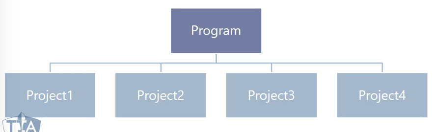

# Program management

A **program** is a group of related projects managed in a coordinated way to
obtain benefits and control not available from managing them individually. Some
aspects of **programs** are provided below:

* **Programs** add some value in managing projects together
* A **project** may or may not be part of a **program**, but a **program** will
always have projects
* **Program** focus on project interdependencies and helps to determine the
optimal approach for managing all subsequent projects

A high-level diagram of **programs** is provided below:

